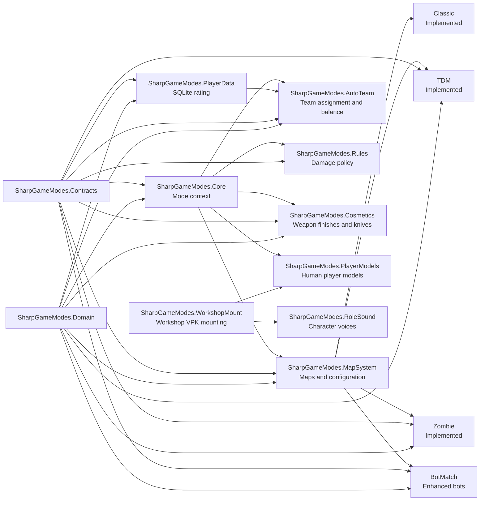

# Architecture

## Goals

SharpGameModes is organized as a set of composable ModSharp modules. Boundaries follow ownership and reasons for change so that game modes and shared services do not accumulate in one assembly.

## Module responsibilities

| Module | Primary responsibility | Out of scope |
| --- | --- | --- |
| `SharpGameModes.Contracts` | Shared mode-context interfaces and immutable DTOs | Game logic, file I/O, ModSharp APIs |
| `SharpGameModes.Domain` | Map-pool validation, pure team-balancing algorithms, round statistics, and rating calculations | Server entities, hooks, timers, file I/O |
| `SharpGameModes.Core` | Publishes a single `IModeContext` | Guessing the mode from a map or executing cfg files |
| `SharpGameModes.MapSystem` | Loads mode map pools, activates a `map + mode` selection, applies cfg files, and presents the corresponding-source offer | Team balancing, infection rules, damage modification |
| `SharpGameModes.PlayerData` | Manages SQLite, collects Classic round data, writes match results, and publishes ratings | Team assignment, health rules, map rules |
| `SharpGameModes.AutoTeam` | Team selection locks, rating-based balance, and health compensation for Classic and TDM | Map voting, string-based mode detection, match-result persistence |
| `SharpGameModes.Rules` | Shared damage-policy hooks | Mode gameplay |
| `SharpGameModes.PlayerModels` | Human-player model menus, T/CT selection, precaching, and ClientPreferences storage | Bot cosmetics, VPK mounting, zombie models |
| `SharpGameModes.Cosmetics` | Weapon finishes and knives with independent SQLite preferences | Bot cosmetics, player models, mode rules, map pools, duplicate glove or agent systems |
| `SharpGameModes.Cosmetics.Storage` | Cosmetic-preference SQLite schema and storage | Game entities and menus |
| `SharpGameModes.WorkshopMount` | Adds the single-file or multipart VPK supplied by `-dual_addon` to the server `GAME` search path during module load and `OnServerInit` | Applying player models, Workshop client negotiation, resource extraction |
| `SharpGameModes.RoleSound` | Resolves character voices from the active model and replaces radio audio | Player-model selection, mode rules, resource extraction |
| `SharpGameModes.TeamDeathmatch` | TDM scoring, respawning, equipment, and weapon selection | Map pools, voting, rating persistence |
| `SharpGameModes.ZombieInfection` | Infection rounds, roles, conversion, models, weapons, and knockback | Map pools, voting, ratings, hard-coded address offsets |
| `SharpGameModes.BotMatch` | Enhanced-bot lifecycle, AI hooks, aiming, grenades, purchases, and bot identities | Map voting, player data, shared team-balancing rules |

## Data flow

The primary key for a map choice is `mode:map`, not the physical map name. Each enabled mode loads an independent `map-pools/<mode>.jsonc` file, and MapSystem merges those files into the voting catalog. A physical map may therefore appear in the Classic, TDM, and Zombie pools at the same time. Nominations, votes, recent maps, and next-map state retain the composite key. Menus display the map name together with its effective mode. Before a map change, MapSystem persists the pending selection; after a Workshop map loads, it resolves the physical map back to the selected mode.

AutoTeam rules also belong to map pools. The top-level `auto_team` object defines mode defaults, while an `auto_team` object on a map provides a sparse override. `SharpGameModes.Domain` merges both layers while loading the pool, and `SharpGameModes.MapSystem` publishes the result in the immutable `MapSelection` snapshot. `SharpGameModes.AutoTeam` and `SharpGameModes.PlayerData` subscribe to that snapshot instead of rereading map pools or inferring modes independently. Global algorithm and persistence settings remain in `auto-team.jsonc` and `player-data.jsonc`.

RTV, nominations, votes, and map-change state belong to `SharpGameModes.MapSystem`. Runtime state is atomically replaced at `sharp/data/sharp-gamemodes/map-system-state.json`, so a module hot reload does not lose an already selected next map. The next-map value is cleared only after the map changes and the new current mode has been committed.

The AGPL corresponding-source notice also belongs to MapSystem because that
module is active across every supported mode and already owns the common chat
commands. It prints the configured URL after a human joins and on
`!source`/`!源码`; it is timer-driven and performs no per-frame work. Modified
deployments must point the URL at their own complete corresponding source.

After a completed match, `SharpGameModes.PlayerData` publishes an immutable result. `SharpGameModes.AutoTeam` consumes that result to update its health-feedback state. Player statistics and SQLite storage therefore remain separate from health-balancing rules, while AutoTeam does not query the match database directly.

Mode definitions accept `classic`, `tdm`, `zombie`, and `botmatch`. The compatibility alias `default` normalizes to `classic`; `bot`, `bots`, and `botclassic` normalize to `botmatch`. Unknown modes are rejected.

## Performance boundaries

- Configuration is parsed only during module initialization or an explicit reload, never in a frame loop.
- Map candidates, searches, and voting sessions are calculated only in response to commands or round events. Nomination menus contain five entries per page.
- The first-round team assignment starts with a greedy partition and then applies deterministic CT/T pair swaps to reduce the average rating difference. Later population corrections move only the required players. Both operations handle at most 64 players at round boundaries.
- Ratings are loaded as a complete table during module initialization or an explicit reload. The balancing hot path reads an immutable in-memory dictionary.
- Rating events are collected only during live Classic rounds. TDM reads historical ratings but does not write TDM match records.
- Landing sounds are checked only during a short window after a player's vertical velocity exceeds the configured threshold. The check does not poll the mode or suppress ordinary footsteps.
- Friendly-fire hooks perform only mode, damage-bit, slot, and team comparisons and never access the database.
- TDM and Zombie hooks remain installed but start with a constant-time current-mode check. Entity, respawn, equipment, model, and knockback operations run only while their mode is active.
- Low-level BotMatch hooks that should not be repeatedly installed and removed retain a constant-time enable gate. Disabling BotMatch stops AI work and restores memory patches, ConVars, timers, and per-bot state.
- Zombie countdown and round HUD updates use one timer chain that runs once per second. They do not scan all entities every frame. Landing velocity is sampled with constant work in the player-command hook.
- Cosmetic catalogs and SQLite preferences are loaded into memory once during initialization. Weapons are updated only when granted, equipped, restored after spawn, or changed by a player.
- Workshop VPKs are mounted once during module initialization. Multipart packages pass the base path without the `_dir` suffix to Source 2, which resolves the `_dir` and `_###` volumes without copying or extracting them.

## Official modules

Administrative features use ModSharp's `CommandCenter`, `AdminManager`, `TargetingManager`, `AdminFlatFile`, and `AdminCommands`. AutoTeam registers `admin:team`-protected commands with those modules instead of maintaining a second permission or target system. Cosmetic menus use the official `MenuManager`. PlayerModels reads the mode context and handles only CT players in Zombie mode so that it does not overwrite the infection module's dedicated T model.
